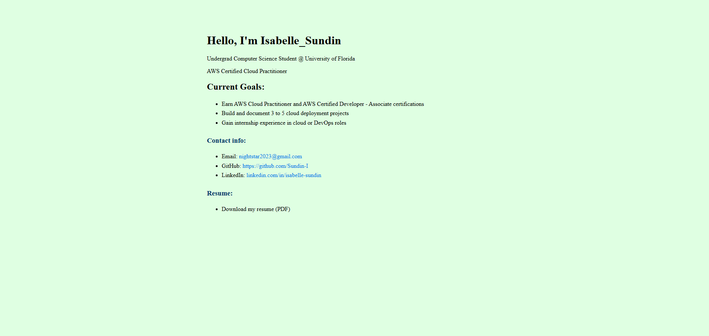

# ☁️ AWS Cloud Portfolio

This project demonstrates a full-featured **AWS cloud portfolio** consisting of:

- ✅ **Static Website** hosted on S3 + CloudFront  
- ✅ **Serverless To-Do API** using AWS Lambda + API Gateway + DynamoDB  
- ✅ **CI/CD Deployment to EC2** using GitHub Actions + AWS CodeDeploy


---

## 🌐 1. Static Website (Frontend)

- **Hosted on**: Amazon S3 (static site hosting)  
- **Accelerated with**: Amazon CloudFront (CDN + HTTPS)  
- **Live URL**:  
  [https://d7q2iujpllljr.cloudfront.net](https://d7q2iujpllljr.cloudfront.net)  
  *(S3 origin: [`sundin-portfoliobucket713.s3-website.us-east-2.amazonaws.com`](http://sundin-portfoliobucket713.s3-website.us-east-2.amazonaws.com))*
### 🔍 Preview




### Features:
- HTML/CSS portfolio showcasing cloud projects  
- Automatically synced via AWS CLI (`aws s3 sync`)

---

## 🧠 2. Serverless API (To-Do App)

- **Built with**: Python (or Node.js) Lambda functions  
- **Accessed through**: Amazon API Gateway  
- **Data stored in**: Amazon DynamoDB

### CRUD Endpoints:
- `GET /tasks` → Fetch all tasks  
- `POST /tasks` → Create a new task  
- `PUT /tasks/{id}` → Update a task  
- `DELETE /tasks/{id}` → Delete a task

### Example Request (`curl`):
```bash
curl https://3ec1acm5mc.execute-api.us-east-2.amazonaws.com/default/tasks

